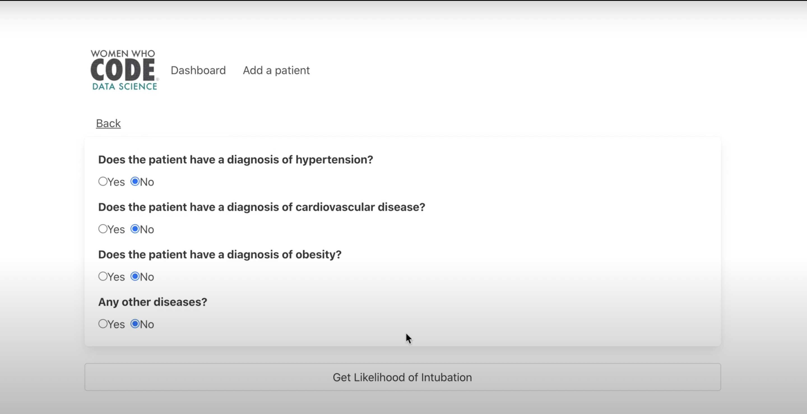

# COVID Intubation Detection

This project was produced as part of the Women Who Code Mission Predictable Hackathon. It came first place!

 

## Description

The project is designed to understand, analyse and predict the possiblity of being intubated in hospital after contracting COVID-19. 

With the shortage of intubation supplies during the pandemic, our aim was to be able to provide insight and planning as to whether intubation supplies would be needed for a patient; allowing supply-chain planning.

The notebooks in this project contain:

* Data Analysis of the COVID Dataset used 
* Correlation Analysis of Features
* Initial model training, benchmarking and evaluation
* AWS version of the model and endpoint creation for deployment 

The React Website is the frontend to interact with the model if it is converted to an endpoint and the website is deployed. The lambda function is the connection between the frontend and the model, returning a simplified version of the predictions.

## Getting Started

### Dependencies

Simply run the requirements.txt file to install all the needed libraries and versions. 

### Installing

The notebooks themselves have the imports for the code in a single file - Library_Imports.ipynb